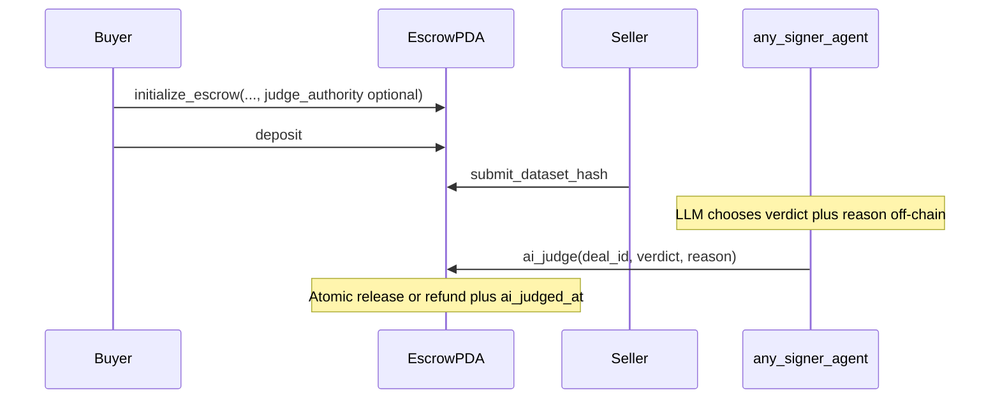

# DataArbiter — Solana program

Anchor program (`data_arbiter`) implements an **escrow state machine** for dataset trades. Replace `declare_id!` and `[programs.*]` in `Anchor.toml` with your deployed program ID after `anchor build && anchor deploy`.

## Flow (primary: permissionless `ai_judge`)



## Security note

`ai_judge` is **callable by any signer** who pays the transaction fee. With `verdict == true` in `STATE_SUBMITTED`, that caller triggers payout to the seller. Trust is **off-chain** (your agent, MPC, reputation), not enforced by a fixed on-chain `judge_authority`. For production, consider adding an oracle, PDA-gated program, or verified payload.

## Instructions

| Instruction | Who | Effect |
|-------------|-----|--------|
| `initialize_escrow` | Buyer | Args: `deal_id`, `amount`, `expected_hash`, **`judge_authority: Option<Pubkey>`**. Creates PDA `["escrow", buyer, seller, deal_id]`. If `None`, stores **`NO_JUDGE_AUTHORITY`** (manual resolve disabled). Sets **`ai_judged_at = 0`**. |
| `deposit` | Buyer | Locks `amount` lamports (`STATE_FUNDED`) |
| `submit_dataset_hash` | Seller | `STATE_SUBMITTED` |
| **`ai_judge`** | **Any `signer`** | **`verdict == true`**: release to seller (needs `SUBMITTED`). **`false`**: refund buyer (`FUNDED` or `SUBMITTED`). Sets **`ai_judged_at`** to `Clock::unix_timestamp`. Emits **`AiJudged`** (+ `Released` / `Refunded`). `reason` max **256** UTF-8 bytes. |
| `release_to_seller` | `judge_authority` | Only if **`judge_authority` was Some at init**; manual dispute path |
| `refund_buyer` | `judge_authority` | Same |

## State and events

- **`Escrow`** includes **`ai_judged_at: i64`** (0 until `ai_judge` succeeds).
- **`AiJudged`**: `{ escrow, deal_id, verdict, reason, judged_at }`.

## Build

```bash
anchor build
anchor test
```

Copy **`target/idl/data_arbiter.json`** after build. Align `DATA_ARBITER_PROGRAM_ID` in [`src/lib/solana/escrow.ts`](../src/lib/solana/escrow.ts).
